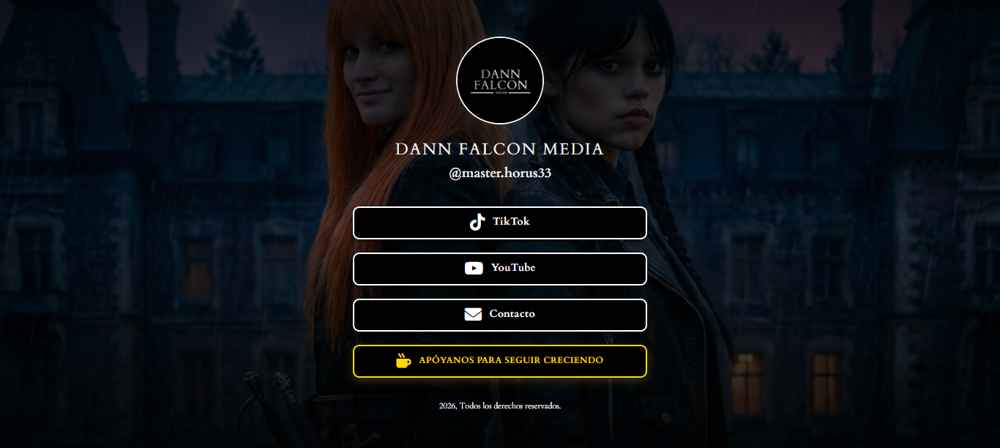

# Dann Falcon Media - Personalized Linktree



Una página de aterrizaje (Landing Page) estilo Linktree, premium y completamente personalizada para la marca **Dann Falcon Media**, creadores de mini series de IA.

Esta aplicación está construida con **React**, **TypeScript** y **Vite**, enfocada en una estética cinematográfica, animaciones fluidas y un diseño totalmente responsivo.

## 🚀 Características

### 🎬 Experiencia Cinematográfica

- **Pantalla de Carga**: Animación de entrada profesional con el nombre de la marca y una barra de progreso plateada.
- **Fondo Personalizado**: Collage estilo póster de fantasía oscura (estilo Netflix) con superposición para mejorar la legibilidad.
- **Estética Dark Mode**: Paleta de colores oscuros, fuentes con serifa ("Cardo") y efectos de vidrio (glassmorphism).

### 🔗 Botones Personalizados e Interactivos

Cada enlace tiene un diseño único y reactivo:

- **TikTok**: Estilo nativo (Negro/Blanco/Cyan) con efecto de pulso y borde animado.
- **YouTube**: Botón negro con efectos rojos y brillo al pasar el mouse.
- **Contacto**: Botón con bordes y sombras que brillan con los colores de Google al hacer hover.
- **Kofi (Soporte)**: Botón dorado con animación de "agitación" (shake) infinita para llamar la atención (CTA).

### 📱 Diseño Responsivo

- Adaptado perfectamente a dispositivos móviles y escritorio.
- Los botones ocupan el ancho completo en móviles para facilitar el toque.

## 🛠️ Tecnologías

- **Vite**: Entorno de desarrollo ultrarrápido.
- **React + TypeScript**: Para una arquitectura de componentes robusta y segura.
- **CSS3 Vanilla**: Estilos personalizados, variables CSS y animaciones keyframes sin dependencias pesadas.
- **FontAwesome**: Para los íconos de las redes sociales.

## ⚙️ Personalización

El contenido de la web está separado de la lógica para facilitar su edición. Todo se gestiona desde un único archivo:

**`src/constants.ts`**

Aquí puedes modificar:

- **Información de la Marca**: Nombre, handle (@usuario), texto del footer.
- **Enlaces Sociales**: URLs, etiquetas, íconos y clases de estilo para cada botón.

Ejemplo:

```typescript
export const SOCIAL_LINKS: SocialLink[] = [
  {
    id: "tiktok",
    url: "https://www.tiktok.com/@tu-usuario", // Cambia esto
    label: "TikTok",
    // ...
  },
  // ...
];
```

## 📦 Instalación y Uso

1.  **Clonar el repositorio** (o descargar los archivos):

    ```bash
    git clone <tu-repositorio>
    ```

2.  **Instalar dependencias**:

    ```bash
    npm install
    ```

3.  **Correr en desarrollo**:

    ```bash
    npm run dev
    ```

4.  **Construir para producción**:
    ```bash
    npm run build
    ```
    Esto generará una carpeta `dist` lista para desplegar en Vercel, Netlify o cualquier host estático.

## 📄 Estructura del Proyecto

- `src/assets/`: Imágenes (perfil, fondo).
- `src/components/`: Componentes React (LoadingScreen, MainContent).
- `src/constants.ts`: Datos editables del sitio.
- `src/types.ts`: Definiciones de tipos TypeScript.
- `src/index.css`: Estilos globales y variables.

---

## Live Demo

https://logostarot.netlify.app/

## Sobre el Desarrollador 👨‍💻

**Yoshua Soto** (Dann Falcon Dev)  
_Fullstack Developer | Especialista en TypeScript_

Creador apasionado por construir aplicaciones que no solo funcionan, sino que asombran. Utilizando la potencia de la IA (Gemini) y tecnologías web modernas, me enfoco en entregar experiencias de usuario (UX) memorables e inmersivas.

📫 **Contacto**

- **Email**: yoshuasoto54@gmail.com
- **WhatsApp**: +58 0422 033 1995

##


© 2026 Dann Falcon Media. Todos los derechos reservados.
